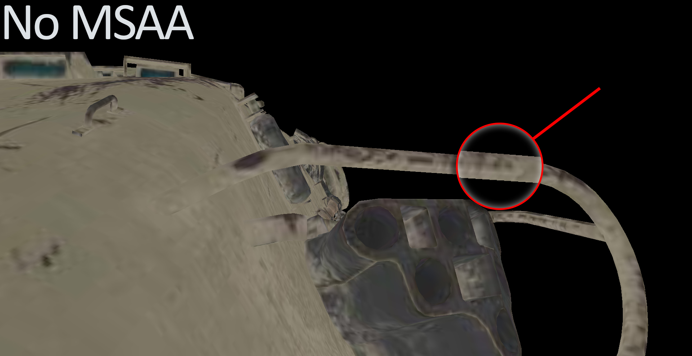
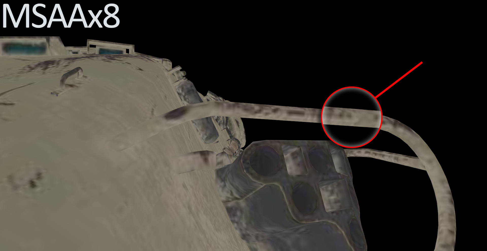

<h1 align="center">Sierra Engine</h1>
<h6 align="center">By: <a href="https://nikichatv.com/Website/N-Studios.html">Nikolay Kanchevski</a></h6>
<br>

<p>
A little <strong>open-source</strong> game engine, which features some of the most common game programming techniques built-in. 
It is based on the <b><a href="https://www.vulkan.org/">Vulkan</a></b> rendering API, which provides support for 
<b>Windows 7-11</b>, <b>macOS</b>, <b>Linux</b>, <b>Android</b>, <b>iOS</b>, <b>tvOS</b> and other operating systems,
though the engine has only been tested on <b>Windows 11</b> and <b>macOS</b>. All of its features are listed below.
</p>


## 🗿 Model Loader

That's right! How can a game engine be an engine and... not allow importing custom 3D models? In Sierra Engine it is as simple as:

```c#
    MeshObject model = new MeshObject.LoadFromModel(FILE_NAME_HERE);
    MeshObject model = new MeshObject.LoadFromModel("Models/Train.obj"); // <-- Example
```

<br>
<br>

## 🖼️ Texturing System

Loading models is cool, but what is the point of it if they are not going to be colored, right? Well, when importing your model, the program automatically picks all textures applied to it and loads them into the renderer. Here is what the following code results in:

```c#
    MeshObject model = MeshObject.LoadFromModel("Models/Chieftain/T95_FV4201_Chieftain.fbx");
```


<br>
<br>

## ☀️ Directional Lighting 

What is that? The tank's lower plate is very dark... strange, right? Nope, not at all.  There is <a href="https://en.wikipedia.org/wiki/Shading#Directional_lighting">Directional Lighting</a> implemented, which is calculated based on the normals of each mesh's vertices. Here is a comparison between <b>no MSAA</b> and <b>MSAAx8</b>:

<br>
<br>

## 👾 MSAA Anti-Aliasing

Because I doubt anyone likes pixelated images, there is a <a href="https://en.wikipedia.org/wiki/Multisample_anti-aliasing#:~:text=Multisample%20anti%2Daliasing%20(MSAA),computer%20graphics%20to%20remove%20jaggies.">MSAA</a> (Multisample Anti-Aliasing) system in place to get rid of all those pesky pixelelated fragments.




<br>
<br>

## 🗺️ Mip Mapping

There is also <a href="https://en.wikipedia.org/wiki/Mipmap">Mip Mapping</a>, which, not only does it get rid of <a href="https://en.wikipedia.org/wiki/Moir%C3%A9_pattern">Moiré patterns</a>, but it also greatly increases the frame rate.

##  🤓️  About

<h4>Information on the project:</h4>
<br>
<p>
    Frameworks used: 
    <ul>
        <li><a href="https://www.vulkan.org/">Vulkan</a> - For both cross-platform and pefromant-friendly rendering.</li>
        <li><a href="https://github.com/glfw/glfw">GLFW</a> - For creating window interface and connecting it to the <b>Vulkan</b> renderer.</li>
        <li><a href="https://github.com/assimp/assimp">Assimp</a> - For the loading of all kinds of 3D model formats (.obj, .fbx, .dae, etc.).</li>
        <li><a href="https://github.com/nothings/stb">Stb</a> - For loading image data from all kinds of image formats (.jpb, .png, etc.).</li>
        <li><a href="https://ih1.redbubble.net/image.528192883.5730/st,small,845x845-pad,1000x1000,f8f8f8.u9.jpg">My Brain</a> - There is not much left of it, actually...</li>
    </ul>
    <br>
    Softwares used: 
    <ul>
        <li><a href="https://www.jetbrains.com/rider/">JetBrains Rider</a> - A <b>cross-platform</b> IDE used to develop the .NET project on both my <b>macOS</b> and <b>Windows</b> systems.</li>
        <li><a href="https://www.blender.org/">Blender</a> - For the testing of 3D model functionality, and their textures.</li>
        <li><a href="https://trello.com/en">Trello</a> - For pretending to have an organized list of things to implement next.</li>
    </ul>
</p>

<br>
<br>
<br>
<br>
<br>
<br>
<br>
<br>
<br>

```c#
using Ultimate.Algorithms.AStar;
```

<br>
<p>Add some variables to make the tweaking of the behavior of the pathfinding easy. Here's an example:</p>

```c#
public int startNodeIndex = 0; // The index of the start node in the grid.nodes list
public int endNodeIndex = 1; // The index of the end node in the grid.nodes list
public float nodeUnwalkablePercentange = 20f;     // Chance of a node being unwalkable
public Vector2Int size; // Size of the grid - X means width and Y means height
```

<br>


<h1 align="center">Grid Pathfinding 2D</h1>
<h6 align="center">By: <a href="https://nikichatv.com/Website/N-Studios.html">N-Studios</a></h6>

<br>
<p align="">A <strong>free-to-use</strong> open source project. Built using the <strong>A* pathfinding algorithm</strong>, on C#, it makes it incredibly easy to set up grid-based pathfinding in a Unity 2D workspace. You can have a look at or build on top of the scripts inside the /Scripts folder. A setup tutorial is listed below and the whole Examples.cs is described with comments on almost every line. Feel free to use in <strong>any kind of projects</strong>. Credit is not required but is appreciated.</p>

<br>

##  ⚙️  Setup

<p>At the very top of your code make sure to reference the AStar namespace by doing:</p>

```c#
using Ultimate.Algorithms.AStar;
```

<br>
<p>Add some variables to make the tweaking of the behavior of the pathfinding easy. Here's an example:</p>

```c#
public int startNodeIndex = 0; // The index of the start node in the grid.nodes list
public int endNodeIndex = 1; // The index of the end node in the grid.nodes list
public float nodeUnwalkablePercentange = 20f;     // Chance of a node being unwalkable
public Vector2Int size; // Size of the grid - X means width and Y means height
```

<br>